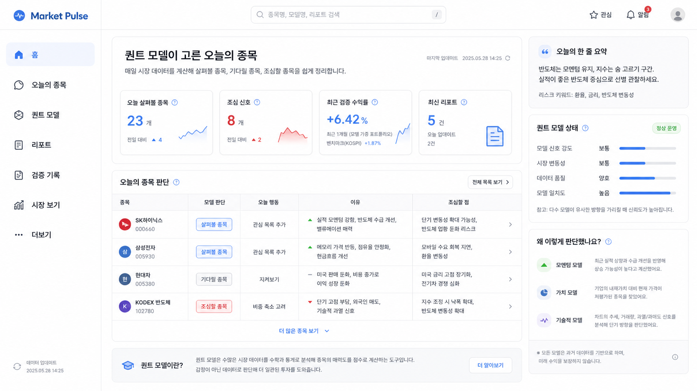

# Market Pulse Quant Home Planning

Date: 2026-05-28  
Scope: `apps/web` frontend planning  
Status: Draft PRD for implementation planning  
Reference: `apps/web/.agents/guides/quant-home-design-guide.md`

## 1. Executive Summary

Market Pulse web should move from a market/index-first home to a quant-model-first home.

The first screen must make the product obvious to a beginner:

```text
퀀트 모델이 고른 오늘의 종목
매일 시장 데이터를 계산해 살펴볼 종목, 기다릴 종목, 조심할 종목을 쉽게 정리합니다.
```

The product keeps the keyword `퀀트 모델`, but translates expert concepts into beginner-friendly language. The home is not a marketing landing page. It is a practical decision dashboard that answers:

- 오늘 어떤 종목을 보면 되는가
- 왜 그렇게 판단했는가
- 어떤 점을 조심해야 하는가
- 어떤 모델이 판단했는가
- 과거 검증 근거는 있는가

## 2. Product Goal

### Primary Goal

Make Market Pulse immediately understandable as:

> a quant-model service that reviews stock-market data every day and explains today's stock decisions in plain language.

### Secondary Goals

- Give users a fast daily decision summary.
- Build trust by showing model state, evidence, and reports.
- Keep market/index data available as supporting context, not the main identity.
- Separate quant investing, market browsing, services, personal account, and admin operations clearly.

### Non-Goals

- Do not build a marketing-only homepage.
- Do not hide the phrase `퀀트 모델`.
- Do not make a separate `m.` mobile site.
- Do not mix lotto/tarot into the core investing flow.
- Do not expose admin operations to normal users.

## 3. Target Users

| User | Need | Home Should Answer |
|---|---|---|
| Beginner investor | Wants simple guidance without expert jargon | "오늘 뭘 보면 되지?" |
| Returning user | Checks daily model decisions quickly | "오늘 달라진 종목이 있나?" |
| Evidence-oriented user | Wants to know why the model judged this way | "근거와 검증 기록이 있나?" |
| Admin/operator | Needs model/data operations separately | "수집/실행/캐시는 정상인가?" |

## 4. Confirmed Visual Direction

### Reference Mockup

Use this mockup as the visual baseline for page ratio, information density, and component placement:



### Visual Rules

- Use the first approved mockup ratio and layout.
- Keep base UI monochrome.
- Use subtle blue only for active navigation, primary actions, focus, and small info markers.
- Use red/blue only for market direction: 상승 red, 하락 blue.
- Use circular stock initial badges, not full company logo files.
- Do not introduce teal, green, orange, beige, gradients, or decorative panels.
- Keep density dashboard-like, not landing-page-like.

## 5. Information Architecture

### Desktop Sidebar

```text
홈
오늘의 종목
퀀트 모델
리포트
검증 기록
시장 보기
더보기
```

### Mobile Bottom Navigation

```text
시장 | 모델 | 홈 | 서비스 | 마이
```

Mobile rationale:

- `홈` stays in the center.
- `오늘의 종목` and `리포트` are accessed strongly from home instead of occupying bottom-nav slots.
- `서비스` groups lotto/tarot.
- `마이` owns profile, saved items, alerts, memos, and admin entry when authorized.

### Profile Entry

- Desktop: top-right profile menu.
- Mobile: `마이` tab.
- Do not add `마이페이지` as a desktop sidebar item.

## 6. Page Map

| Area | Route Direction | Purpose | Priority |
|---|---|---|---|
| 홈 | `/` | Quant-model-first home and daily decision summary | P0 |
| 오늘의 종목 | `/quant/today` or `/quant` tab | Full decision list: look/wait/caution | P0 |
| 퀀트 모델 | `/quant/models` | Model list, status, explanations | P0 |
| 모델 상세 | `/quant/models/:modelCode` | Model detail, positions, candidates, reports | P1 |
| 리포트 | `/reports` | Daily/weekly model evidence | P0 |
| 리포트 상세 | `/reports/:reportId` | Full rule-based report content | P1 |
| 검증 기록 | `/quant/backtest` or `/quant/evidence` | Backtest and validation evidence | P1 |
| 시장 보기 | `/market` | Existing market/index/news/investor-flow dashboard | P1 |
| 서비스 | `/services` or menu group | Lotto and tarot entry | P2 |
| 마이 | `/my` | Profile, saved reports, alerts, memos, account | P1 |
| 관리자 | `/admin/*` | Admin-only operations | P1 |

## 7. Home Page Detailed Plan

### 7.1 Desktop Layout

```text
Left sidebar | Top header/search
             | Main dashboard                 | Right insight rail
```

### 7.2 Main Dashboard Sections

| Order | Section | Purpose | Content |
|---|---|---|---|
| 1 | Hero | Explain what this page does | title, beginner subtitle, update time |
| 2 | KPI cards | Daily status at a glance | look count, caution count, validation return, latest report |
| 3 | Today decision table | Main action surface | stock, model judgment, action, reason, caution |
| 4 | Quant explainer | Beginner education | short `퀀트 모델이란?` explanation |

### 7.3 Right Insight Rail

| Order | Panel | Purpose |
|---|---|---|
| 1 | 오늘의 한 줄 요약 | daily plain-language summary |
| 2 | 퀀트 모델 상태 | signal strength, volatility, data quality, model agreement |
| 3 | 왜 이렇게 판단했나요? | reason categories, not raw model math |
| 4 | disclaimer | past data based, no future guarantee |

### 7.4 KPI Cards

| Card | Meaning | Data | Click |
|---|---|---|---|
| 오늘 살펴볼 종목 | Model says worth reviewing | count + delta | today list filtered to look |
| 조심 신호 | Needs caution or confirmation | count + delta | today list filtered to caution |
| 최근 검증 수익률 | Recent validation summary | return pct + benchmark | 검증 기록 |
| 최신 리포트 | Latest generated reports | count/time | 리포트 |

Rules:

- `조심 신호` should not be visually overdramatic.
- Red is not a generic recommendation color.
- Positive/negative numbers can use red/blue.
- KPI labels use beginner language.

### 7.5 Today Decision Table

Default desktop columns:

```text
종목 | 모델 판단 | 오늘 행동 | 이유 | 조심할 점
```

Optional model source behavior:

- If space allows, add compact `신호 모델`.
- If not, show a small info icon beside `모델 판단`.
- Multiple signals display as `여러 모델`.
- Desktop hover shows exact model names.
- Mobile tap/expand shows exact model names.

Row content:

| Field | Example | Rule |
|---|---|---|
| 종목 | SK하이닉스 / 000660 | stock badge + name + code |
| 모델 판단 | 살펴볼 종목 | badge, not too colorful |
| 오늘 행동 | 관심 목록 추가 | action-oriented plain text |
| 이유 | 실적 모멘텀 강함, 수급 개선 | max 2 short bullets |
| 조심할 점 | 단기 변동성 확대 가능성 | max 2 short bullets |

## 8. Language System

### Beginner Surface Terms

| Expert Term | Beginner Term |
|---|---|
| signal | 오늘의 판단 |
| candidate | 오늘의 종목 |
| buy candidate | 살펴볼 종목 |
| watchlist | 기다릴 종목 |
| risk flag | 조심할 점 |
| trim | 비중 축소 고려 |
| backtest | 검증 기록 |
| diagnostics | 모델 점검 |
| portfolio target | 목표 비중 |

### Allowed Advanced Terms

Allowed in model detail, report, and validation pages:

- 백테스트
- 리밸런싱
- 포트폴리오 목표 비중
- MDD
- Sharpe
- factor score
- diagnostics

Rule: show expert terms only after the beginner explanation is available.

## 9. Stock Badge System

Use circular initial badges:

| Stock | Badge |
|---|---|
| SK하이닉스 | red circle + `SK` or simple mark |
| 삼성전자 | blue circle + `삼` |
| 현대차 | dark blue circle + `현` |
| KODEX 반도체 | purple circle + `K` |

Badge size:

- desktop: about 32px
- mobile: about 36px

Rules:

- Do not use full third-party logo assets by default.
- Use badges for recognition only.
- Badge colors do not define market direction.
- Keep badges compact and aligned with stock name/code.

## 10. Mobile Plan

Mobile uses one responsive app, not `m.`.

Bottom nav:

```text
시장 | 모델 | 홈 | 서비스 | 마이
```

### Mobile Tab Responsibilities

| Tab | Contains |
|---|---|
| 시장 | index, stock search, investor flow, news |
| 모델 | quant model list, model status, model detail |
| 홈 | today decisions, one-line summary, latest report, evidence summary |
| 서비스 | lotto, tarot |
| 마이 | profile, interest list, memo, alerts, saved reports, account, admin if allowed |

### Mobile Home Structure

1. Header/profile/search compact row
2. Title and short explanation
3. Compact KPI cards, 2x2
4. Today's decision card list
5. Latest report card
6. Collapsible `퀀트 모델이란?`
7. Model state summary

### Mobile Decision Card

Each stock card should show:

```text
[badge] 종목명      [모델 판단]
       code
오늘 행동
이유 1~2줄
조심할 점 1줄
여러 모델, tap to expand if applicable
```

## 11. My Page Plan

Desktop entry:

- top-right profile menu

Mobile entry:

- `마이` bottom tab

My page sections:

| Section | Content |
|---|---|
| Profile | username, role, account status |
| 관심 종목 | saved stocks |
| 내 메모 | memo list and shortcuts |
| 알림 설정 | report/model/market alerts |
| 저장한 리포트 | bookmarked reports |
| 계정 정보 | login/session/account actions |
| 관리자 | visible only for ADMIN |

## 12. Services Plan

`서비스` is separate from the core quant investing flow.

Contains:

- 로또
- 타로

Rules:

- Do not show lotto/tarot as core home sections.
- Use service cards/list rows under `서비스`.
- Keep the quant home focused on stock model decisions.

## 13. Admin And Permissions

Admin should be separate from beginner-facing quant flows.

Rules:

- Desktop admin entry appears only for `ADMIN`.
- Mobile admin entry appears inside `마이` only for `ADMIN`.
- `/admin/*` should be route-protected.
- Admin contains operations: data collection, model run controls, cache management, users, logs.
- Normal user UI should not show admin actions disabled; it should not show them at all.

## 14. Data Requirements

### Home Aggregation Shape

The frontend should eventually consume a single home aggregation response.

Suggested shape:

```ts
interface QuantHomeResponse {
  asOf: string;
  summaryText: string;
  kpis: {
    lookCount: number;
    lookDelta: number;
    cautionCount: number;
    cautionDelta: number;
    recentValidationReturnPct: number | null;
    benchmarkReturnPct: number | null;
    latestReportCount: number;
    latestReportTime: string | null;
  };
  decisions: QuantHomeDecision[];
  modelState: QuantHomeModelState;
  latestReports: QuantHomeReportSummary[];
}
```

Suggested decision row:

```ts
interface QuantHomeDecision {
  assetCode: string;
  assetName: string;
  market: string;
  badgeText: string;
  badgeTone: string;
  modelNames: string[];
  modelLabel: "상승장 모델" | "횡보장 모델" | "하락장 모델" | "여러 모델";
  decisionLabel: "살펴볼 종목" | "기다릴 종목" | "조심할 종목";
  actionText: string;
  reasonBullets: string[];
  cautionBullets: string[];
}
```

Existing APIs may be composed first before a dedicated endpoint exists.

## 15. Loading, Empty, Error States

| State | UX |
|---|---|
| Loading | skeleton cards/table rows |
| No decisions | "오늘 표시할 종목이 없습니다. 최신 리포트를 확인해 주세요." |
| Data delayed | show right-rail notice and as-of time |
| API error | compact error card with retry |
| Unauthenticated | allow public read if policy allows, otherwise login CTA |
| Admin missing permission | hide admin entry or show 403 route |

## 16. Suggested Frontend Structure

```text
src/pages/QuantHome/
  index.tsx
  components/
    QuantHomeHeader.tsx
    QuantHomeKpiGrid.tsx
    TodayDecisionTable.tsx
    TodayDecisionMobileList.tsx
    QuantInsightRail.tsx
    QuantModelExplainer.tsx
    StockInitialBadge.tsx
  hooks/
    useQuantHomeData.ts
  quantHomeTypes.ts
```

Keep existing market dashboard as:

```text
src/pages/Dashboard/
```

Route direction:

```text
/       -> QuantHome
/market -> existing Dashboard
```

Avoid adding more responsibility to:

```text
src/pages/QuantDashboard/index.tsx
```

It is already large and should be split gradually.

## 17. Implementation Phases

### Phase 1: Static Home Shell

- Add `src/pages/QuantHome/`.
- Build desktop shell using static sample data.
- Build mobile card list and bottom nav shape.
- Move current market dashboard route direction to `/market`.

### Phase 2: Navigation And Permissions

- Update desktop sidebar.
- Update mobile bottom nav.
- Add profile/my entry.
- Add admin route guard and visibility rules.

### Phase 3: Data Wiring

- Compose existing quant/report APIs into home hook.
- Add skeleton/empty/error states.
- Add `여러 모델` hover/tap expansion.

### Phase 4: Route Cleanup

- Decide whether `/quant` is today's list or model overview.
- Connect `/quant/backtest` or `/quant/evidence`.
- Split `QuantDashboard/index.tsx` gradually.

## 18. Acceptance Criteria

Home is acceptable when:

- A first-time user can understand what the service does within 5 seconds.
- The phrase `퀀트 모델` is visible on first screen.
- The page explains today’s stocks with plain-language decisions.
- Desktop ratio matches the approved reference mockup.
- Mobile bottom nav is `시장 | 모델 | 홈 | 서비스 | 마이`.
- Mobile does not use a wide table.
- Lotto/tarot are not mixed into the quant home.
- Admin is hidden from normal users.
- Red/blue are reserved for market direction.
- Stock rows use circular initial badges.

## 19. Open Decisions

1. Whether `/quant` becomes today's decision list or model overview.
2. Whether report and validation evidence are separate nav items on desktop after implementation.
3. Exact API contract for home aggregation.
4. Whether desktop table uses a permanent `신호 모델` column or tooltip-only model source.
5. Public-read policy for unauthenticated home users.

## 20. Next Implementation Step

Start with the home shell and static data:

1. Add `src/pages/QuantHome/`.
2. Route `/` to `QuantHome`.
3. Move current market home to `/market`.
4. Update desktop and mobile navigation.
5. Build responsive desktop table/mobile card list.
6. Wire API after the layout and language are approved.
