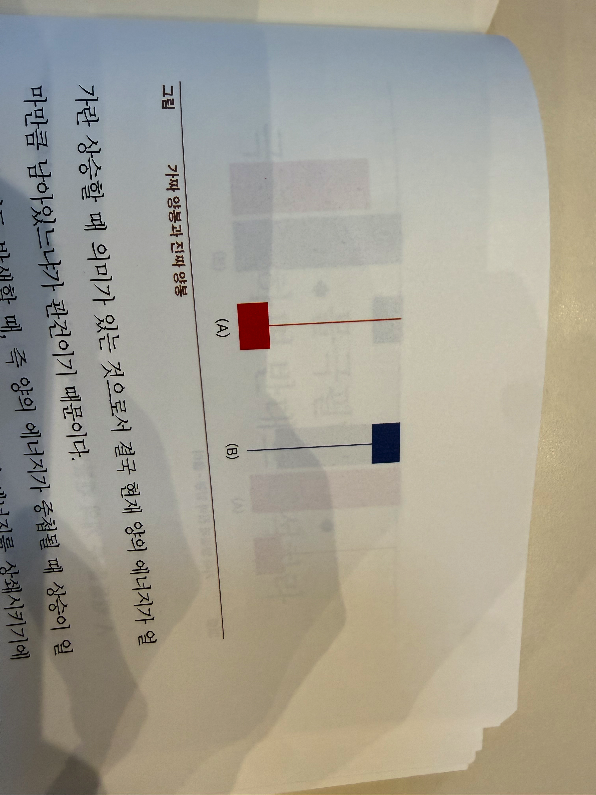
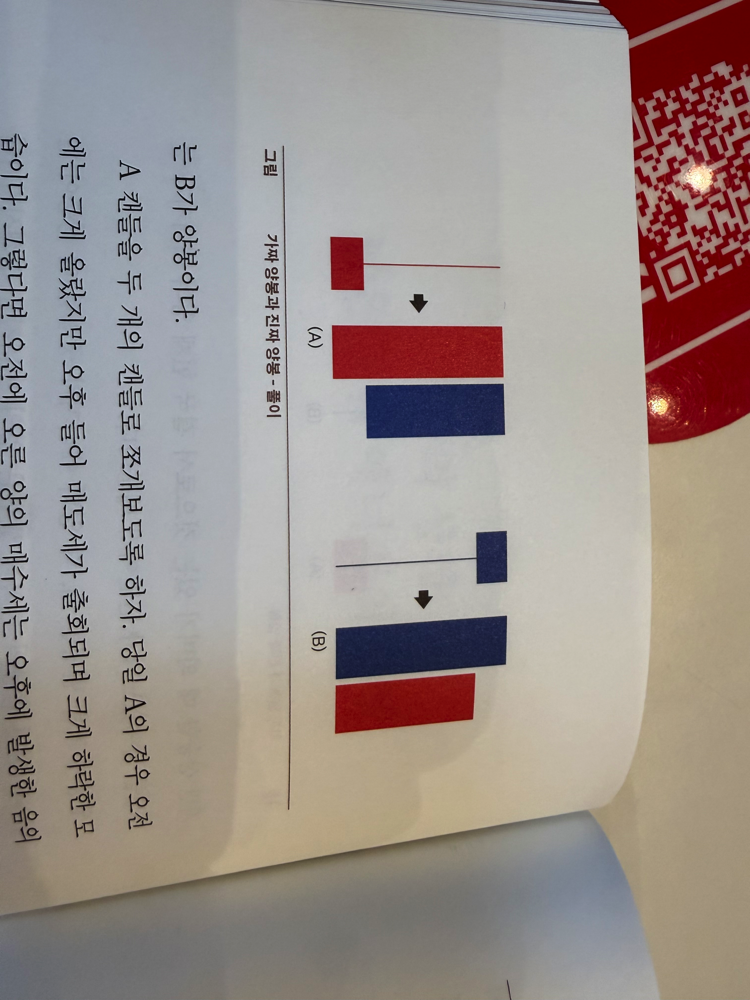
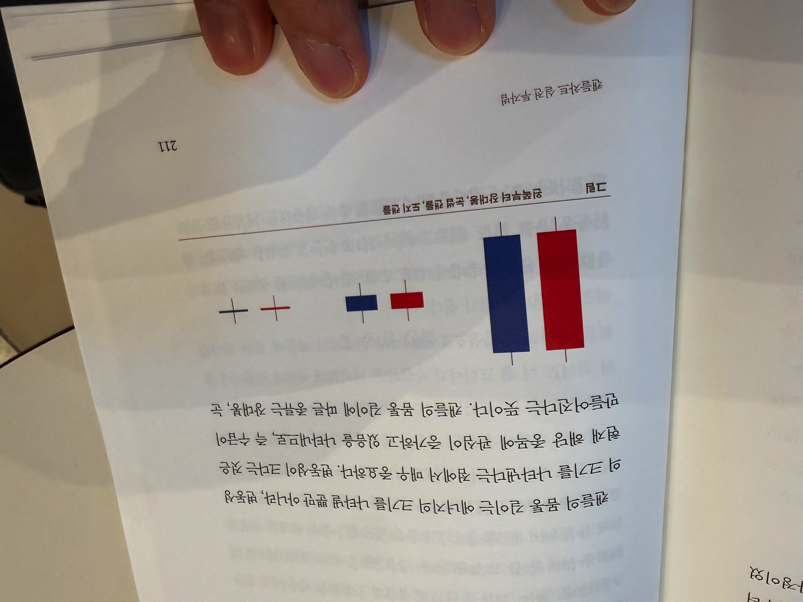
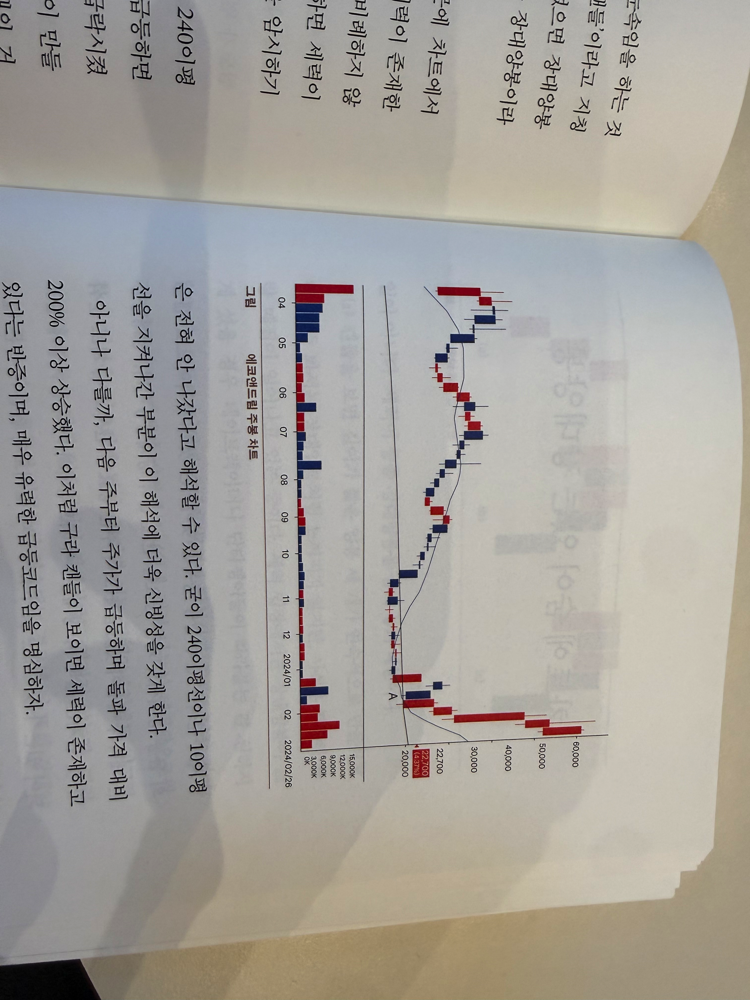
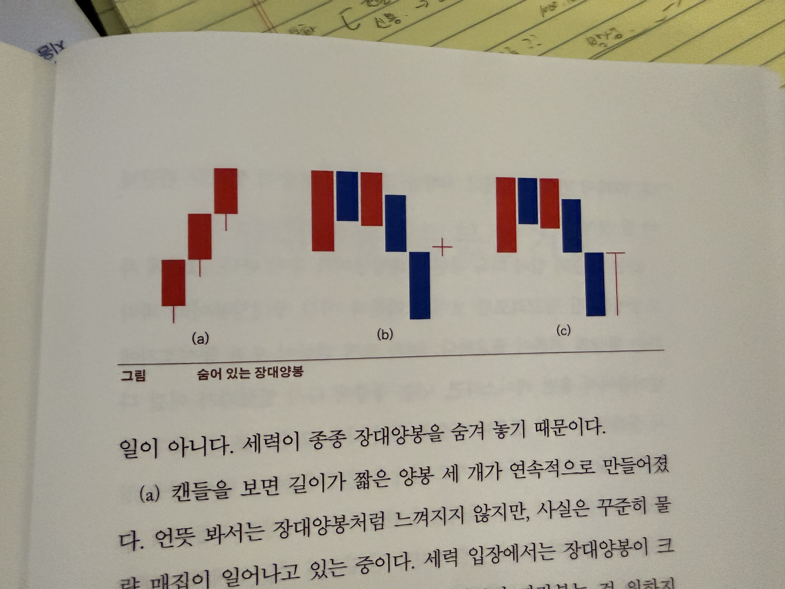
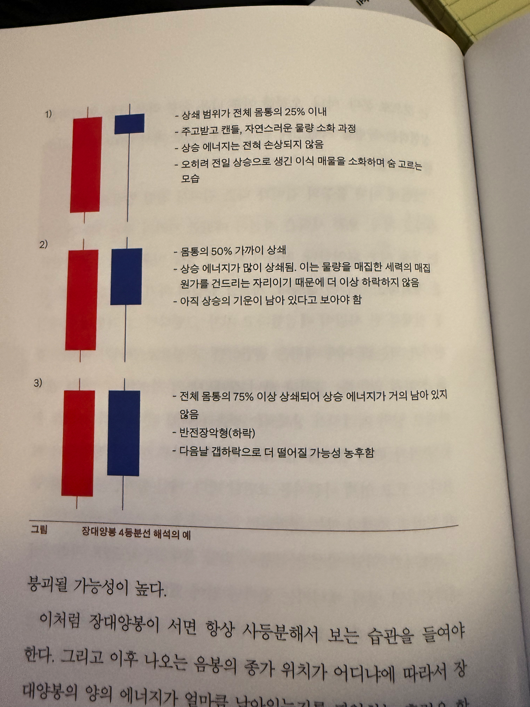

### 캔들차트 '5대 분석기'

거래가 두 번 이루어지면 캔들이 하나 생기고,
캔들이 두 개 만들어지면 파동이 하나 발생하며,
파동이 두 개 겹치면 추세가 하나 만들어진다.
그리고 이것들은 모두 이평선 위에 존재한다.

차트 분석을 하는데 굳이 많은 것들을 알 필요 없이
'거래(량), 캔들, 파동(패턴), 추세, 이평선'
오직 이 5가지만 정확히 알면 된다.

매매, 즉 거래가 이루어지지 않으면 시장도 존재하지 않으며
그 어떤것도 발생하지 않는다.
따라서 시장에서 가장 중요한 것이 거래다.
그런데 캔들 하나가 만들어지려면 하루에 적어도 두 번은 거래가 이루어져야 한다.
그래서 거래가 두 번 이루어지면 캔들이 하나 생긴다 한 것이다.

파동이 만들어지기 위해선 음봉과 양봉이 교차하면 된다.
음봉 다음에 양봉이면 상승파동이 만들어질 것이고,
양봉 다음에 음봉이라면 하락 파동이 만들어질 것이다.
따라서 파동이 만들어지기 위한 최소 캔들 단위는 두 개다.
그래서 캔들이 두 개 만들어지면 파동이 하나 만들어지게 되는 것디아.

추세도 마찬가지다. 파동과 파동을 연결한 선이 추세선이다.
파동의 고점과 고점을 연결하면 하락 추세선이 될 것이고,
파동의 저점과 저점이 연결되면 상승 추세선이 될 것인데
이 때도 추세를 하나 만들기 위한 파동의 최소 개수는 두 개다.
이처럼 파동이 두 개 가 겹치면 추세가 하나 만들어진다 하겠다.

그리고 이 모든 것들은 이평선 위에 존재한다고 했다.
하필이면 이평선 아래도 아니고 이평선 위를 강조했음에 주목하자.
이는 차트 분석에 있어서 가장 중요한 부분이다.
주가가 아무리 상승하려 해도 이평선이 위에 있다면 이는 모두 저항선이다.
따라서 주가가 힘을 받고 상승하기 위해선 이평선이 차트 아래에서 단단하게
지지선 역할을 해 주고 있어야 한다.
그래서 제대로 된 차트가 되기 위해선 반드시 이 모든 것들이 이평선 위에 존재해야 한다 한 것이다.

차트 분석을 함에 있어서 핵심 중의 핵심이 이 5대 분석기이다.

### 에너지의 응축 캔들

## 캔들의 음양 음봉vs양봉
음양은 캔들의 색깔을 뜻한다.
매일 아침 9시부터 15시 30분까지 총 6시간 30분 동안 장이 열린다.
장이 시작되면 '시가'가 생기고, 장이 마감될 때 '종가'가 나온다.
그동안 주가가 오르내리면서 고가와 저가를 기록하게 되고
이 4가지 지표로 하나의 일봉이 만들어진다.
일봉으로 봤을때 시가보다 종가가 높게 상승으로 끝나면 양봉, 당일 시가보다 종가가 낮게 끝나면 음봉이다.
즉 주가가 상승하는 양봉은 빨간색, 하락하는 음봉은 파란색이다.

## 캔들의 상쇄: 남은 양의 에너지의 행방
캔들이 음양의 에너지를 보여 주는 기본 단위라 할 때,
우리는 반복되는 캔들의 모습들을 통해 음양이 서로 중첩되고 상쇄되는 과정을 추론 할 수 있다.
그리고 차트의 맨 오른쪽에 남아 있는 에너지가 무엇인지도 쉽게 알아낼 수 있다.
캔들은 자체적으로 에너지를 가지므로 각각 서로를 상쇄하면서 해당 에너지가 살아있거나
사라지게 된다.
캔들 상쇄의 개념을 알아야 캔들의 생과 사가 느껴지고,
각각의 캔들 유형에 대한 이해가 확실해지면 주가 방향을 판단 할 수 있는 기초 자료를 확보할 수 있다.
그런데 캔들 상쇄를 논할 때는 특히 양의 에너지가 음의 에너지에 의해 얼마나 많이 상쇄되었는지가 매우 중요하다.
왜냐하면 주가란 상승할 때 의미가 있는 것으로서 결국 현재 양의 에너지가 얼마만큼 남아있느냐가 관건이기 때문이다.
양봉이 거듭 발생할 때 즉 양의 에너지가 중첩될 때 상승이 일어난다.
반면 음봉의 반복적 발현은 양의 에너지를 상쇄시키기에 주가의 상승은 꺾일 수밖에 없다.
만약 음이 양을 압도한다면 결코 상승은 일ㅇ어나지 않을 것이며, 반대로 양의 기세가 강한 반면
음의 상쇄 정도가 약하다면 급등이 일어날 수도 있다.
따라서 우리는 차트상에서 끊임없이 이 상쇄의 정도를 파악하며 마지막에 남은 에너지가 어느 쪽인지 파악하는 것이 매우 중요하다.
다만 캔들의 음양을 보이는 색깔 그대로 이해해서는 안된다.
음 속에 양이 있고, 양 속에 음이 있기 때문이다. 캔들을 보이는 그대로 보다가는 반대로 보는 경우가 생길 수 있다.
색깔에 의한 착시 현상이 빈번하기 때문이다.
위 두 개의 캔들에서 A와 B중 양봉캔들은 무엇일까?

대부분의 사람은 색깔만 보고 a가 양봉이라 생각할 것이다. 하지만 실제로는 B가 양봉이다.
A 캔들을 두 개의 캔들로 쪼개보도록 하자.
당일 ㅁ의 경우 오전에는 크게 올랐지만 오후 들어 매도세가 출회되면 크게 하락한 모습니다.
그렇다면 오전에 오른 양의 매수세는 오후에 발생한 음의 매도에에 이미 대부분의 에너지가 상쇄된 모습니다.
따라서 A가 색깔은 붉은 색으로 양봉의 모습ㅂ을 띄고 있지만 본질적으로는 음봉이다.
반면 B의 경우엔 오전에 매도 물량이 집중되며 크게 내렸지만
오후 들어 매수세가 살아나며 이를 대부분 회복하였다.
따라서 엄의 매도 에너지는 이미 양의 매수 에너지에 의해 거의 상쇄되었다.
결국 B 캔들은 본질적으로는 음봉이 아니라 양봉이다.
이처럼 차트를 보다 보면 여러 가지 착시 현상으로 그 본질을 제대로 보지 못하는 경우가 많다.
특히 캔들의 곁만 보고 그 속살을 보지 못하면 이런 착각을 하게 된다.

## 물극 필반: 극에 달하면 반대로 해석하라
모든 에너지는 정반합의 과정을 거친다.
차트도 마찬가지다.
양의 에너지가 극에 달하면 음으로 화하고, 음의 에너지가 극에 달하면 양이 서서히 생겨난다. 이는 물극필반의 이치로서 차트 분석을 할 때에도
주의해서 살펴 볼 부분이다.
예를 들어 주가가 계속 상승한다고 하자.
그러면 차트상에서는 주가가 급등하며 매일 양봉이 이어진다.
그렇다면 이는 양의 에너지가 극에 달해있다 할 수 있다. 매수가 결집되고 있기 때문이다.
반면 그 종목을 가진 사람들의 심리는 다르다.
주가가 오르면 오를수록 팔고자 하는 욕구는 극대화되며, 언제 팔지 눈치만 보게 된다.
이는 말 그대로 매도의 에너지가 점차 커지고 있는 모습니다.
그리고 그 음의 에너지가 극에 달하면 결국 물ㄹ량이 터져 나오게 되고, 주가는 급락하게 된다.
급등하면 급락하는 이유가 바로 이런 이치에서 연유한다.
반대로 주가가 연일 떨어져서 바닥을 치고 있다고 치자.
이제 이 종목엔 아무도 관심을 가지지 않게 되었다. 사는 이도 없고, 파는 이도 없는 상태다.
겉으로 보기엔 음이 극에 달해 매수세가 실종된 모습니다.
하지만 아니다. 이미 음의 에너지는 오랜 기간 조정을 통해 거의 소멸되었고,
따라서 조금만 모멘텀이 생겨도 주가는 이때부터 상승하게 된다.
사실은 양의 에너지가 조금씩 축적되는 과정이었을 뿐이다.

## 캔들 '몸통'은 당일 변동성을 나타낸다

캔들의 몸통 길이는 에너지의 크기를 나타낼 뿐만 아니라, 변동성의 크기를 나타낸다는 점에서 매우 중요하다.
변동성이 크다는 것은 현재 해당 종목에 관심이 증가하고 있음을 나타내므로, 즉 수급이 만들어진다는 뜻이다.
캔들의 몸통 길이에 따른 종류는 장대봉, 눈썹 캔들, 도지 캔들(십자형)이라는 딱 3가지만 제대로 알면 된다.

1. 장대봉
장대봉은 몸통이 긴 캔들을 말하는데 빨간색은 '장대양봉', 파란색은'장대음봉'이라고 부른다.
차트에서는 수급이 들어오는 종목을 찾는 것이 무척 중요한데, 캔들의 몸통이 길다는 건 수급이
들어오고 나가는 것이라 에너지가 그만큼 크다는 뜻.
이때 장대양봉은 '물량 매집'으로 보고 장대음봉은 '물량 출회'로 봄.
따라서 장대양봉이 나오면 세력이 물량을 매집하였기에 상승할 가능성이 높아지는 반면,
장대음봉 출현 시에는 시장에 물량이 출회되며 개미들에게 분산되었기 때문에
에너지가 모이기 어렵고, 이로 인한 강한 하락을 예상할 수 있음.

2. 눈썹 캔들
눈썹 캔들은 몸통의 길이도 짧고 꼬리의 길이도 매우 짧은 캔들을 말함.
캔들의 길이가 짧다는 것은 그만큼 당일 해당 종목에 대한 변동성이 적었다는 것을 말하며,
거래량 또한 적을 수밖에 없음.
그래서 보통 눈썹 캔들은 추세를 잠시 쉬어가거나 해당 종목에 대한 시장의 관심도가 매우 적을 때 발생함.
눈썹 캔들이 연속되며 거래량이 미미하다면 상승의 매집세가 만들어지지 않고 있음을 의미함.

3. 도지 캔들
도지 캔들은 시가와 종가가 동일한데 꼬리의 길이가 매우 짧은 캔들을 지칭함.
도지 캔들 역시 거래량이 거의 없기에 시장의 관심도가 떨어질 때 발생하는 캔들이지만 가끔 발생 위치에 따라
중요도가 올라가기도 해 해석 시 이 점에 유의할 필요가 있음

이처럼 캔들의 몸동은 당일의 변동성을 의미하며, 이를 시장의 관심도로 보기도 함.
특히 거래가 많이 이루어진 곳에서는 사람의 심리도 더 잘 드러나기 마련.
개인보다 세력의 매집이나 출회는 하나의 방향성으로 에너지가 집중되기 때문에
캔들 하나만 봐도 그 심리를 읽기 쉬움.
대개는 몸통의 길이에 따라 거래량이 비례하지만 때로는 그렇지 않은 경우도 있음.
예를 들어 장대봉임에도 거래량이 적은 경우가 있고, 반대로 눈썹이나 도지 캔들인데
거래량이 크게 들어오기도 함.
이는 대부분 세력이 개미들을 속이기 위해 눈속임을 하는 것이므로
보통 '세력이 구라를 친다'고 하여 '구라 캔들'이라고 지칭함.
캔들 크기나 모양에 맞는 합당한 거래량이 없으면 장대양봉이라 하더라도
속 빈 대나무나 마찬가지.
진정한 장대양봉이라 볼 수 없음
그런데 구라 캔들이야말로 세력이 만듬. 그 때문에 차트에서 보였을 때 매매에 역 이용할 수도 있음.
해당 종목에 세력이 존재한다는 반증이므로, 차트 분석시 캔들 몸통과 거래량이 비례하지 않는 구라 캔들이 보이면
예의주시할 필요가 있음.
왜냐하면 세력이 존재한다는 것을 조만간 그 종목이 크게 갈 수도 있음을 암시하기 때문.
다음 에코앤드림 주봉 차트를 보면 주가가 오랫동안 240이평선 밑에 붙어서 물량을 매집해 나간 모습이 보인다.
이후 급등하면서 240이평선을 뚫었지만 뚫자마자 주가를 패대기 치며 급락시켰다.
재밋는 것은 A의 장대음봉이다. 보통 저 정도의 장대봉이 만들어지려면 상당한 거래량이 수반되어야만 한다.
그런데 아래의 거래량을 보면 매우 적다는 사실을 알 수 있다. 한마디로 구라 캔들이다.
240이평선을 강하게 뚫는 과정에서 개미들이 달라붙자 세력이 이를 떨구는 과정에서 의도적으로 만들어진 것으로 보임.
저 캔들의 하략률이 -23%. 저 정도 급락했음에도 물량이 나오지 않았다는 것은
개미들을 겁만 줘서 떨구어 냈을 뿐 세력 자체 물량은 전혀 안 나갔다고 해석할 수 있음.
굳이 240이평선이다 10이평선을 지켜나간 부분이 이 해석에 더욱 신빙성을 갖게 함.
아니나 다를까, 다음 주부터 주가가 급등하며 돌파 가격 대비 200% 이상 상승.
이처럼 구라 캔들이 보이면 세력이 존재하고 있다는 반등이며, 매우 유력한 급등코드임을 명심.

## 차트에 숨어 있는 장대양봉
차트 분석은 결국 상승 종목을 찾아내는 것이 목적이므로 캔들의
몸통 중에서도 가장 중요한 건 당연히 장대양봉이다.
장대양봉은 세력의 매집이 있었음을 보여 주는 중요한 단서로서, 차트 분석의
첫 단계는 결국 이 장대양봉이 차트상에서 어디에 어떻게 분포되어 있는지
찾아내는 것이다. 수급이 들어오지 않는 종목은 결코 상승할 수 없으며
수급이 들어왔다면 응당 장대양봉을 만들기 때문이다.
몸통 길이가 적어도 전일 대비 5~7% 이상인 장대양봉이 반복적으로 나온다면
그만큼 매수세가 반복되고 있다는 뜻이므로 상승 가능성이 높다.
그러나 차트상에서 장대양봉을 한눈에 파악하는 것은 그리 쉬운일이 아니다.
세력이 종종 장대양봉을 숨겨 놓기 때문이다.
a캔들을 보면 길이가 짧은 양봉 세개가 연속적으로 만들어졌다. 언뜻 봐서는
장대양봉처럼 느껴지지 않지만, 사실은 꾸준히 물량 매집이 일어나고 있는 중이다.
세력 입장에서는 장대양봉이 크게 섰을 경우 데이트레이더나 단타쟁이들이
따라붙는 걸 원하지 않는다. 그들은 어차피 소기의 목적만 달성하는 곧바로 나걸 것이기 때문이다.
따라서 이렇게 3~4일에 걸쳐 나누어 매집함으로써 착시 현상을 일으키게 된다.
그러면 이는 장대양봉임에도 비교적 시장의 주목을 받지 않을뿐더러 검색식에도 걸리지 않는다.
따라서 이처럼 작은 몸통의 양봉들이 연속되는 경우엔 이 또한 장대양봉으로 보아야 한다.
b는 장대음봉이 나온 후 갑자기 그 위에 훌쩍 도지 캔들이 만들어졌다.
보통 도지 캔들은 시장이 쉬어가거나 수급의 힘이 없을때 만들어지므로 사람들이 이를 무시하기 쉽다.
그러나 위의 경우엔 장대음봉의 매도세를 모두 상쇄하고 급등한 케이스로 봐야 한다.
따라서 전일 종가에서 시작한 장대양봉이 숨어 있다고 판단해야 할 것이다.
c는 상승의 힘이 더욱 강한 장대양봉이라 봐야한다. 그런데 차트상에선
긴 밑꼬리로만 보이기 때문에 이걸 장대양봉이라 파악하는 발상의 전환이 필요하다.
b의 도지 캔들이 오전 동시호가에 밀어붙여서 올린 케이스라면, c는 장중에 다시 밀렸다가 이걸
다시 상쇄해서 올린 경우니 상승의 힘이 더욱 크다고 볼 수 있다.
말하자면 장 시작 전 동시호가로 밀어 올린 장대양봉과 함께 장중 밀렸던 주가를
다시 밀어 올리면서 만들어진 장대양봉이 동시에 존재한다는 말이다.
그러니 맨 마지막 긴 밑꼬리 캔들 안에서는 캔들 세개를 몰 줄 알아야 한다.
이처럼 차트상에는 종종 숨어있는 장대양봉들이 존재하기에
매우 주의 깊게 보지 않으면 놓칠 가능성이 높다. 차트에 숨어 있는
장대양봉을 찾는 것은 매우 중요하며, 이는 캔들을 쪼개고 합쳐 봐야 비로소 발견할 수 있다.

## 장대양봉 4등분선 기법
장대양봉이 나올 정도의 주가 상승은 반드시 일정 수준의 매도 물량을 부름.
단기 수익을 찾아 먹고자 하는 '수익실현욕구'가 자극되기 때문.
따라서 장대양봉 직후 만들어지는 음봉이 양의 에너지를 어느 정도 상쇄시켰는지 파악하는것은 매우 중요함.
만약 지나치게 많은 매도 물량이 나온다면 기껏 끌어올린 주가 상승분을 크게 반납하는 것은 물론 추가 상승의 가능섣오 사라지게 됨.
이때 장대양봉을 통해 만들어진 상승의 양의 에너지가 이후 발생하는 음봉의 위치에 따라 어느정도 상쇄되었는지를 파악하는 방법이
'장대양봉 4등분선 기법'임.

일단 장대양봉의 몸통을 4등분하기만 하면 됨. 이때 캔들의 꼬리 부분은 제외됨.
장대양봉의 몸통을 4등분 했을 때 몸통의 바닥에서 25%되는 위치는 '절대 자리'라 부름.
그리고 정중앙 가운데 50% 위치는 '매입원가', 몸통에서 75% 높이 되는 자리는 '안전지대'라고 함.
만약 주가 급등으로 장대양봉이 발생하였는데 다음날 음봉이 나왔다면
이 4등분선 위치를 통해서 상승의 양의 에너지가 어느 정도 남아 있는지를 가늠할 수 있음.
비록 다음날 음봉이 나왔다 하더라도 종가 기준으로 안전지대 75% 위에 위치하고 있다면
결코 걱정할 일이 없음. 양의 에너지는 거의 상쇄되지 않았기 때문.
보통 이러면 다음번 상승을 위해 쉬어가는 자리라 보면 됨.
따라서 이런 경우엔 상승의 양의 에너지가 25% 깎인 75%만 남아있다 하지 않고 100% 온전히 남아 있는 것으로 봄.
아니, 오히려 이후 나온 음봉 역시 급등 후 이익을 실현하는 물량을 자연스레 받아낸 매집으로 봐서 (100+)%로 간주할 수도 있음.
그런데 이 때 음봉의 길이가 다소 길어서 전일 양봉의 중간까지 왔다고 치차. 보통 세력은 자신이 매집한 가격의 평균가를 건드리는 것을 매우 싫어함.
따라서 되도록 상승 이후에 매입 원가만큼은 지키려는 마음이 강함. 계산을 간단히 하기 위해 장대양봉 몸통 전체를
한 사람이 매집했다고 침. 그렇다면 그 가운데가 매입 원가가 되는데 이때 세력은 웬만하면 그 밑으로 주가가 빠지는 것을 원하지 않음.
그러다 보니 장대양봉의 가운데, 즉 매입 원가 아래로 양의 에너지가 상쇄되는 것을 꺼리게 됨.따라서 만약 음봉 종가가 매입 원가를 건드렸다면
이는 향후 상승에 빨간불이 켜졌다고 보고 언제 나갈지를 고민할 때임.
매입 원가만큼은 어떤 일이 있어도 지켜야 하는 것임.
그렇다면 익일 발생한 음봉이 전일 장대양봉의 25% 자리까지 내려왔다면
양의 에너지는 얼마나 남아 있다고 여길 수 있을까?
결론 부터 말하자면 0%임. 장대양봉의 절대 자리가 훼손되었다면
이미 상승의 여력은 완전히 상쇄되었다 봐야 함. 그래서 이 자리를 '절대 자리'라 부르는 것.
절대적으로 지켜야 하는 자리라서 그럼. 만약 이 절대 자리까지 음봉이 침범하였다면
장대양봉의 생명은 다했다고 보면 됨. 하락 에너지가 매우 커졌기 때문에 곧 붕괴될 가능성이 높음.

이처럼 장대양봉이 서면 항상 사등분해서 보는 습관을 들여야 함.
그리고 이후 나오는 음봉의 종가 위치가 어디냐에 따라서
장대양봉의 양의 에너지가 얼마큼 남아있는지를 파악하는 훈련을 할 필요가 있다.
만약 다음날에도 이어서 장대양봉이 섰다면 맨 위의 장대양봉만 사등분해도 되지만, 장대양봉들 전체를 하나로 합쳐서
4등분해 볼 수도 있음.
이 '4등분선 기법'은 이처럼 캔들뿐만 아니라 파동, 추세에도 적용할 수 있음.
상승 파동이나 상승추세를 4등분선으로 구분해 놓고 각각의 위치에 따라 그 의미를 해석한다는 면에서 방법은 동일함.